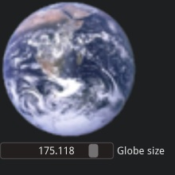

# Edition widgets in Python and C++

We will now create an application which allows to interactively change the size of an image.
We will use a slider to change this size, and store it in the application state.



**Difference between C++ and Python**
* In C++, function names follow the CamelCase convention, while in Python, they are written in snake_case.
* In C++, ImGui widgets modify variables directly using pointers. The return value of `ImGui::SliderFloat` is a `bool` indicating whether the value was changed.
* In Python, ImGui widgets such as `imgui.slider_float` return a tuple `(changed, new_value)`. For this reason, in the code below, we store the first element of the tuple in a variable called _changed, and the second element in app_state.globe_size

**About hello_imgui.image_from_asset**

Here, we use Hello ImGui to display images. See the doc about Hello ImGui for more information.
image_from_asset will keep the aspect ratio of the image if one of the dimensions is set to 0.


**Python**
```{literalinclude} widget_edit.py
```


**C++**
```{literalinclude} widget_edit.cpp
```

## Looking for more widgets?
**Other widgets?**
There are **many** widgets in Dear ImGui, and Dear ImGui Bundle. Look at the next pages of this tutorial for more examples.

If you are in a hurry, you can look at the [Dear ImGui Manual](https://pthom.github.io/imgui_manual_online/manual/imgui_manual.html),
for which you can find a preview below:

<video controls width="600">
  <source src="https://github.com/pthom/imgui_bundle/releases/download/v1.6.1/imgui_manual.mp4" type="video/mp4">
  Your browser does not support the video tag.
</video>
